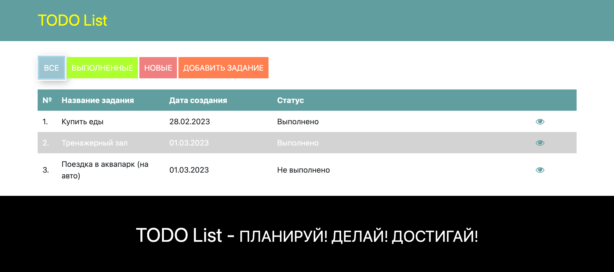
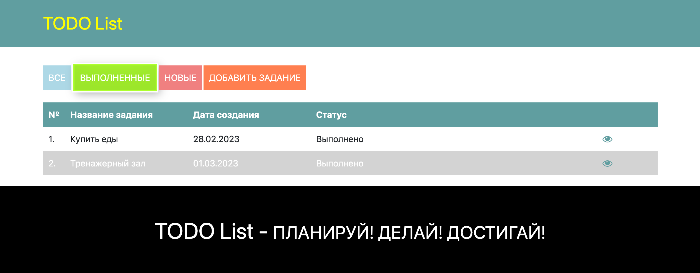
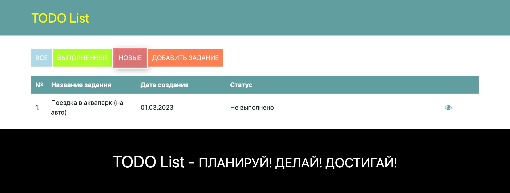
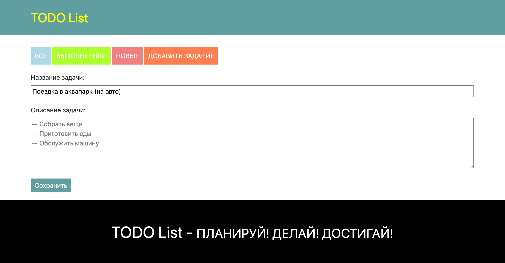
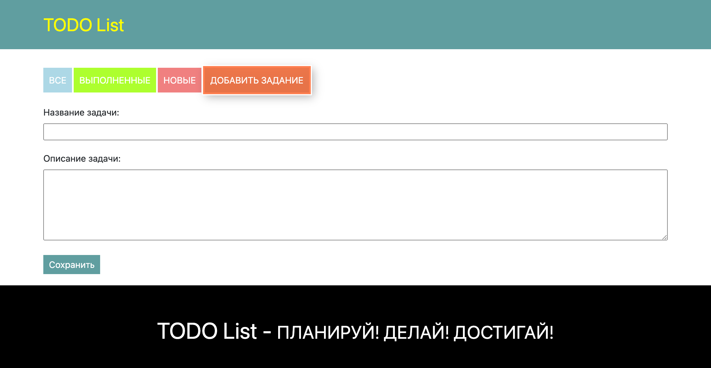
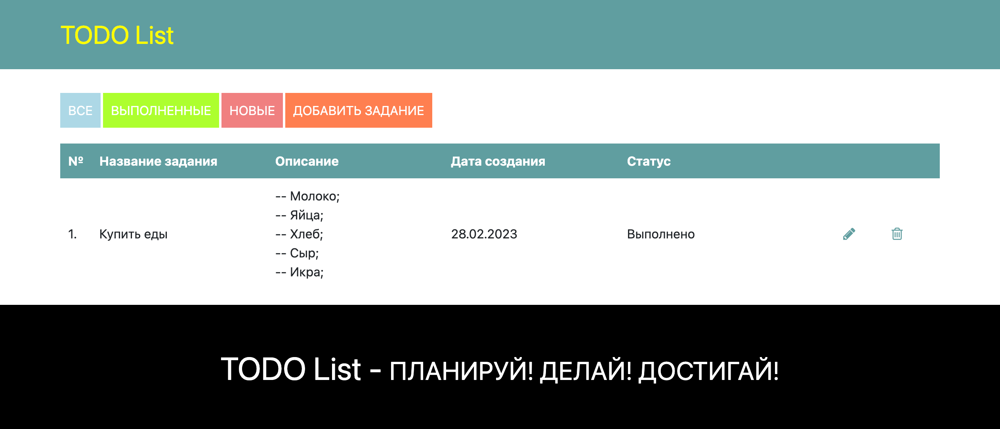

# job4j_todo

## О проекте

Приложение для управления списком задач. Позволяет создавать, редактировать, удалять и просматривать статусы задач.

## Стек Технологий

- Spring boot  2.7.3
- Thymeleaf 2.7.6
- Hibernate 5.6.11
- PostgresSql 14
- Lombok 1.18.22
- Liquibase 4.15.0

## Требования к окружению

- Java 17
- Maven 4.0.0
- Postgres 14

## Запуск проекта

Создать базу данных с названием todo
```
create database todo;
```

Заменить данные подключения к БД.
Хранятся по пути src/main/resources/hibernate.cfg.xml
```
 <property name="hibernate.connection.driver_class">org.postgresql.Driver</property>
 <property name="hibernate.connection.url">jdbc:postgresql://127.0.0.1:5432/todo</property>
 <property name="hibernate.connection.username">postgres</property>
 <property name="hibernate.connection.password">password</property>
```

В Настроках Liquibase данные подключения к БД заменить на свои
Хранятся по пути db/liquibase.properties
```
changeLogFile= db/dbchangelog.xml
url=jdbc:postgresql://127.0.0.1:5432/todo
driver=org.postgresql.Driver
username=postgres
password=password
```

```
mvn clean install
mvn spring-boot:run
```

## Взаимодействие с приложением
### **Список задач**


### **Выполненные задачи**


### **Новые задачи**


### **Редактирование задачи**


### **Добавление новой задачи**


### **Подробная страница задачи**


